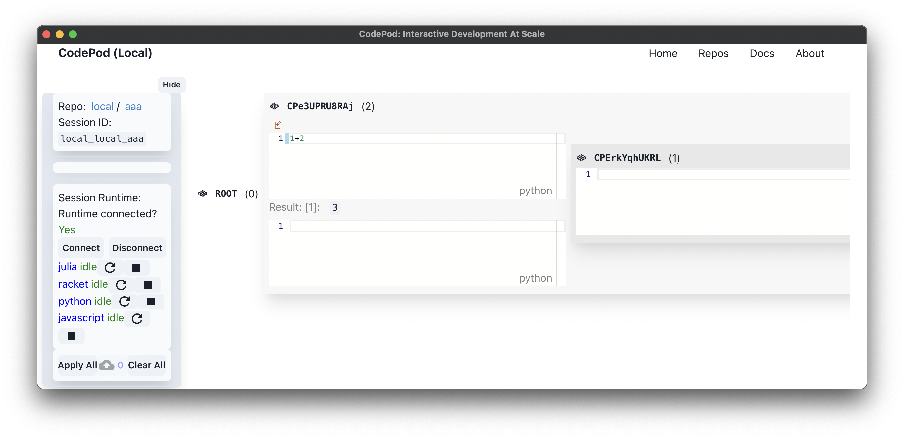

# CodePod: A Hierarchical IDE for Interactive Development at Scale



# Installation

Binary release available for Linux and MacOS. See release page.

For Debian/Ubuntu:

```
sudo dpkg -i codepod_0.1.0_amd64.deb
```

On Mac, use the `codepod_0.1.0_arm64.dmg` image (for M1 Macs with Apple Sillicon).

You can run `codepod` either in application launcher or through the `codepod` command line tool.

# Install Jupyter kernels

These kernels are Jupyter kernels. CodePod should detect them and work as long
as they are properly installed to work in Jupyter.

## python

```
sudo apt install python3
```

Install ipykernel:

```
python3 -m pip install ipykernel
python3 -m ipykernel install --user
```

## racket

Install on Ubuntu:

```
sudo add-apt-repository ppa:plt/racket
sudo apt-get update
sudo apt install racket
```

Install zmq:

```
brew install zmq
sudo apt install libzmq5
```

```
raco pkg install --auto iracket
raco iracket install
```

On mac, zeromq lib cannot be found by racket due to [a known
issue](https://github.com/rmculpepper/racket-zeromq/issues/6). To side-step it
(replace the version numbers with your installation):

```
cp /opt/homebrew/Cellar/zeromq/4.3.4/lib/libzmq.5.dylib ~/Library/Racket/8.2/lib
```

## julia

Install julia from the official binaries. On Ubuntu:

```
curl -O https://julialang-s3.julialang.org/bin/linux/x64/1.6/julia-1.6.4-linux-x86_64.tar.gz
tar -xvzf julia-1.6.4-linux-x86_64.tar.gz
sudo mv julia-1.6.4/ /opt/
sudo ln -s /opt/julia-1.6.4/bin/julia /usr/local/bin/julia
```

<!--
```
julia
]add add IJulia
import IJulia
IJulia.installkernel("Julia nodeps", "--depwarn=no")
```

Or just -->

Install kernel:

```
julia -e 'import Pkg; Pkg.add("IJulia"); using IJulia; installkernel("Julia nodeps", "--depwarn=no")'
```

## Javascript

```
npm install -g ijavascript
ijsinstall
```

# Using remote runtime

In the runtime section in the sidebar, you can add a new runtime. For the runtime, you need to specify the two addresses: the websocket address for sending code to server, and the MQ address for receiving output. If MQ address is empty, the websocket will be used.

The default runtime is the local runtime, which is `localhost:14321`

To start the server, on the server machine, you need to setup the kernels. Then, you need to clone this repo, go into the cpkernel folder, and do:

1. `docker-compose up -d`. This will setup a rabbitmq server. The MQ address is `:15674`
2. `npm run kernel-server`. This will run the server. The websocket address is `:14321`

So to use this server, enter:

- `<your-server-ip>:14321` for the socket address
- `<your-server-ip>:15674` for the MQ address

We can spawn a docker container on the server for the kernels. However, it will be tricky to access files and install packages. One has to install packages for every restart of the kernel, and one has to mount a volume to exchange files between the server and the container. Thus we think it is a better experience to use the bare-metal server.

# Development Scripts

Develop

```
cd app
npm run dev
```

Build:

```
cd app
npm run build:all
```
