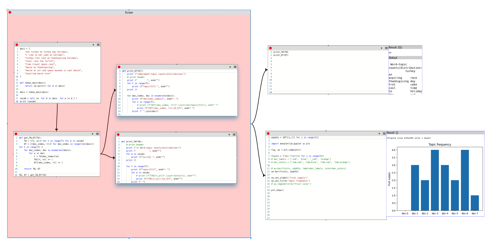

# CodePod: coding on a canvas, organized.

Codepod provides the interactive coding experience popularized by Jupyter, but
with scalability and production-readiness. Users can still incrementally build
up code by trying out a small code snippet each time. But they would not be
overwhelmed by the great number of code snippets as the projects grow.k

<div align="center"><h2>Feel free to
  visit <a href="https://codepod.io" target="_blank">our homepage</a>,
  read the <a href="https://codepod.io/docs/manual/" target="_blank">manual</a>,
  or <a href="https://app.codepod.io" target="_blank">try it online</a>
</h2></div>



# Contributing

CodePod is open-source under an MIT license. Feel free to contribute to make
it better together with us. You can contribute by [creating awesome showcases](#gallery), 
[reporting a bug, suggesting a feature](https://github.com/codepod-io/codepod/issues), 
or submitting a pull request. 
Do use [Prettier](https://prettier.io/) (e.g., [its VSCode
plugin](https://marketplace.visualstudio.com/items?itemName=esbenp.prettier-vscode))
to format your code before checking in. 
Last but not least, give us a star on Github! 

# Gallery 

Thanks to our community, we now have CodePod showcases ranging from analytical geometry to bioinformatics. 

* [plotting common functions](https://app.codepod.io/repo/2ncnioylo9abo3otdxjs)
* [image operations using skimage](https://user-images.githubusercontent.com/44469195/239033643-decbd7ae-29bb-44b9-af33-d4cb7c2bce46.png)
* [tel-siRNA sequence detector](https://app.codepod.io/repo/b94n7n00a9395xwhv1o8)

# Developing CodePod using docker-compose

First clone CodePod: 

```bash
git clone https://github.com/codepod-io/codepod.git
```

We use the variable `CODEPOD_ROOT` to refer to the root folder of the CodePod. 
If you just ran the command above, then `CODEPOD_ROOT` is the folder you just cloned.

Now enter the `CODEPOD_ROOT/compose` folder: 

```bash
cd codepod/compose
```

The docker compose files are in `CODEPOD_ROOT/compose/dev` folder. The `dev` stack mounts the
`src` folder, so that you can edit the files on your local computer, and let the
node.js process inside the container do the compiling and hot-reloading.

To install docker-compose, follow the official [Docker documentation](https://docs.docker.com/compose/install/linux/).

## .env file

Now enter the `CODEPOD_ROOT/compose/dev` folder 


```bash
cd dev
```

and create a `.env` file with the following content (leave as is or change the value to
whatever you want).

```properties
# Mandatory settings
POSTGRES_USER=myusername
POSTGRES_PASSWORD=mypassword
POSTGRES_DB=mydbname
JWT_SECRET=mysupersecretjwttoken

# optional settings
GOOGLE_CLIENT_ID=<google oauth client id>

EXPORT_AWS_S3_REGION=us-west-1
EXPORT_AWS_S3_BUCKET=<YOUR_BUCKET_NAME>
EXPORT_AWS_S3_ACCESS_KEY_ID=<YOUR_ACCESS_KEY>
EXPORT_AWS_S3_SECRET_ACCESS_KEY=<YOUR_SECRET_ACCESS_KEY>
```

Optional:

- Leave the `GOOGLE_CLIENT_ID` empty if you do not need the OAuth provided by Google.
- `EXPORT_AWS_S3_XXX` are used for file export. You could leave it empty if you don't use it.

## Starting the stack

From the `CODEPOD_ROOT/compose/dev` folder, run:

```bash
docker compose up -d
```

If you this is your first time setting up CodePod, or the database schema has been updated (which you can tell from errors), you will also need to [initalize database tables](#initializing-the-database).

Wait a few minutes for the package installation and compilation. Once the `ui` and
`api` containers are ready, go to `http://localhost:80` to see the app.

- `http://localhost:80/graphql`: Apollo GraphQL explorer for the backend APIs
- `http://prisma.127.0.0.1.sslip.io`: Prisma Studio for viewing and debugging the database.

### Initializing database tables

To initialize or update the database schema, open a shell into the API container (by default called `dev-api-1` but please use `docker ps` to confirm): 
  
  ```bash
  docker exec -it dev-api-1 /bin/bash
  ```

and then **from the shell of the API container** run:


> Known issues: if you get the error below during the migration, 
> 
> ```bash
> EACCES: permission denied, unlink '/app/node_modules/.prisma/client/index.js'
> EACCES: permission denied, unlink '/app/node_modules/.prisma/client/index.js'
> ```
> then please change the ownership of the folder `node_modules` (**from the shell of the API container**):
> ```bash
> chown node:node node_modules/ -R
> ```
> Afterwards, re-run 
> ```bash
> npx prisma migrate dev
> ```

### Preparing for database migration

If you are a developer who wants to change the database schema for adding a feature, you can update the schema file `CODEPOD_ROOT/api/prisma/schema.prisma` and then run 

  ```bash
  npx prisma migrate dev --name add_a_new_field
  ```

to generate a migration, like [this](./api/prisma/migrations/20221206194247_add_google_login/migration.sql).
The schema change along with this migration need to be checked in (add, commit, and push) to git.

## Auto-completion & Linting

Although we developed this project using docker, we still want features like auto-completion and linting while coding. For that to work, you need to install the all the relevant node packages, i.e.

```bash
# api, proxy, runtime, ui
cd ./api/

# Run 'npm install' instead if you are using npm
yarn
```


# Citation

https://arxiv.org/abs/2301.02410

```
@misc{https://doi.org/10.48550/arxiv.2301.02410,
  doi = {10.48550/ARXIV.2301.02410},
  url = {https://arxiv.org/abs/2301.02410},
  author = {Li, Hebi and Bao, Forrest Sheng and Xiao, Qi and Tian, Jin},
  title = {Codepod: A Namespace-Aware, Hierarchical Jupyter for Interactive Development at Scale},
  publisher = {arXiv},
  year = {2023},
  copyright = {Creative Commons Attribution 4.0 International}
}
```