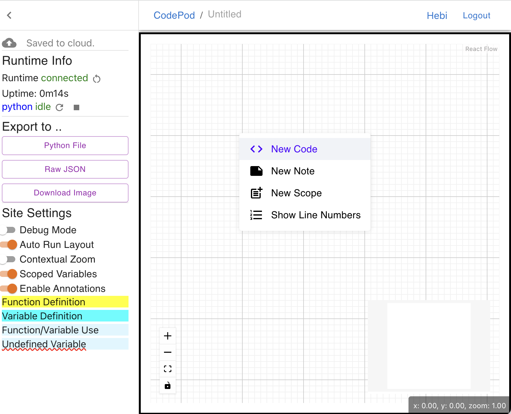

# User Manual

**Try it [here (experimental)](https://app.codepod.io)**

## Signup & Login

Codepod is a web application that offers standard user authentication. Moreover,
you can experience the convenience of instant access by logging in with your
Google account.

## The dashboard and project creation

You will be greeted with the dashboard. It will list your projects and those that shared with you by other users. You can create a new project on the dashboard, which drops you into the new project canvas.

<!--  -->

## The Canvas

### Create your first code pod

In the canvas, you can right-click on the Canvas to create pods and scopes. Create a new pod, and you can type your hello world code in the cell.

<!--  -->

### The runtime and sidebar

The sidebar shows some status of the project and runtime, as well as settings. Wait until you have the runtime ready and idle for running code. The sidebar can be folded with the "Fold" button.

### Execute the code

Back to your code, you can execute the pod by clicking the "run" button on the floating toolbar, or press `<shift>+<enter>`.

### Moving around the Canvas

You can move your pods with the drag handles on the toolbar. Simply drag-n-drop.

## Organize your Canvas with scopes

### Create your first scope

One key feature that Codepod brings is the scope. You can create a scope by right-clicking on the canvas. Scopes are like modules in your code, they can be nested, and you can move your pods into scopes. Drag-n-drop your pods into the scope; a target scope will be highlighted when you drag a pod over it.

You can also run all the pods in the scope by clicking the "Run" button in the scope toolbar. It will execute all pods and scopes in the scope by geometric order, from top-left to bottom-right.

### The scoped runtime semantics

The scoped runtime supports python variables, functions, and classes. You can define them in the scope, and use them in the pods. The scope is like a python module. All names defined in the scope stays inside the scope. The outside world cannot see it.

### Export to parent as public API

A scope can define some public APIs, which can be used by outer scopes. You can define a public API by adding a `@export` decorator at the first line of the pod. Once you execute it, the pod will be highlighted with a thick green border to indicate that this pod defines a public API. The public API can then be resolved in outer scope.

The names can be further exported to ancestor nodes.

### Lexical scoping

The other direction, from parent scope to child scope, is automatic. It works like the lexical scoping where inner scopes can see the names in outer scopes. This enables you to define global variables and utility functions in the outermost scope, and use them anywhere on the Canvas.

## Writing docs in Rich-text editor

We integrate the Remirror/ProseMirror editor, so that you can write rich-text documents in the pods. You can create a rich-text pod by right-clicking on the canvas. The rich-text pod supports markdown syntax, and you can insert images and videos.

The rich-text editor supports:

- Markdown syntax
- Insert images
- Tables
- Links

## Copy-n-paste

You can copy a pod or a scope, and paste it anywhere on the canvas. The copy-n-paste feature is in the pod toolbar. You can also paste across browser tabs. On paste, a shadowed visualization will be moving with your cursor until you click to drop it.

## Auto-layout

It is painful and inefficient to resize and position the pods and scopes manually. Codepod provides an auto-layout feature to help you organize your canvas. The auto-layout setting is in the sidebar, default to enabled.

Before auto-layout, the pods and scopes could be overlapped and messy.

After auto-layout, the pods and scopes are organized by a collision-free algorithm, and the scopes will be resized to fit the pods inside.

## Contextual zooming

The canvas can be zoomed in and out by the touch pad pining, the buttons, and the mouse wheel. We introduce a major feature called "contextual zoom". The idea is to see different level of details at different zoom levels, so that users can focus on a small subsets of content to work on. Think of it as Google maps where you zoom in & out to see different levels of details.

The feature contains roughly two significant behaviors:

1. different levels in the hierarchy have different font sizes
2. when zooming out, the pods and scopes that become too small to view will be collapsed into a block, with large text summarizing its content. These blocks can be dragged and moved easily (which is pretty easy to use).

This feature is experimental and disabled by default. There's a setting contextual zoom in the sidebar to enable it.

Fully expanded (zoomed in):

Zoom out:

Zoom out:

Zoom out:

## Exporting

You can export your project into a SVG image, executable Python files, and a Jupyter notebook. The export button is in the sidebar.

## Share your project and collaborate in real time

Modern collaboration cannot be without real-time collaboration. Codepod supports real-time collaboration. You can share your project with other users, and they can edit the project together with you in real time.

The shared projects will be shown in the bottom of the Guest's dashboard. The real-time collaboration happens in the following places:

- The code pods
- The rich-text pods
- The Canvas: nodes and edges

## In case of the app went wrong

The project is still in heavy development, and bugs can happen. If you find the page is not responding, you can try to refresh the page.

If you would like to hunter the bugs, welcome and thanks! You can open the developer console and see if there are errors. Let us know by openning a GitHub issue.
