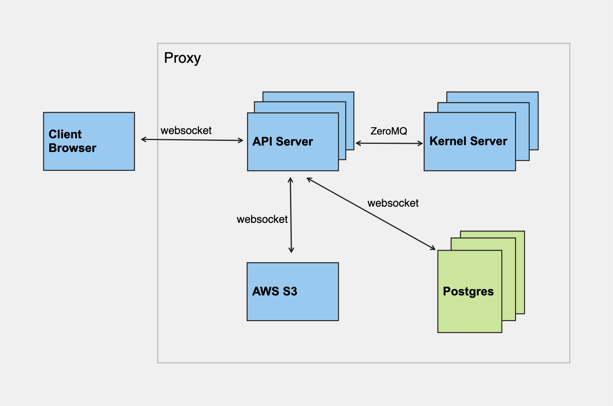

# Developer Manual

First clone CodePod:

```bash
git clone https://github.com/codepod-io/codepod.git
```

We use the variable `CODEPOD_ROOT` to refer to the root folder of the CodePod.
If you just ran the command above, then `CODEPOD_ROOT` is the folder you just cloned.

Now enter the `CODEPOD_ROOT/compose` folder:

```bash
cd codepod/compose
```

The docker compose files are in `CODEPOD_ROOT/compose/dev` folder. The `dev` stack mounts the
`src` folder, so that you can edit the files on your local computer, and let the
node.js process inside the container do the compiling and hot-reloading.

To install docker-compose, follow the official [Docker documentation](https://docs.docker.com/compose/install/linux/).

## .env file

Now enter the `CODEPOD_ROOT/compose/dev` folder

```bash
cd dev
```

and create a `.env` file with the following content (leave as is or change the value to
whatever you want).

```properties
# Mandatory settings
POSTGRES_USER=myusername
POSTGRES_PASSWORD=mypassword
POSTGRES_DB=mydbname
JWT_SECRET=mysupersecretjwttoken

# optional settings
GOOGLE_CLIENT_ID=<google oauth client id>

EXPORT_AWS_S3_REGION=us-west-1
EXPORT_AWS_S3_BUCKET=<YOUR_BUCKET_NAME>
EXPORT_AWS_S3_ACCESS_KEY_ID=<YOUR_ACCESS_KEY>
EXPORT_AWS_S3_SECRET_ACCESS_KEY=<YOUR_SECRET_ACCESS_KEY>
```

Optional:

- Leave the `GOOGLE_CLIENT_ID` empty if you do not need the OAuth provided by Google.
- `EXPORT_AWS_S3_XXX` are used for file export. You could leave it empty if you don't use it.

## Starting the stack

From the `CODEPOD_ROOT/compose/dev` folder, run:

```bash
docker compose up -d
```

If you this is your first time setting up CodePod, or the database schema has been updated (which you can tell from errors), you will also need to [initalize database tables](#initializing-the-database).

Wait a few minutes for the package installation and compilation. Once the `ui` and
`api` containers are ready, go to `http://localhost:8080` to see the app.

- `http://localhost:8080/graphql`: Apollo GraphQL explorer for the backend APIs
- `http://prisma.127.0.0.1.sslip.io`: Prisma Studio for viewing and debugging the database.

### Initializing database tables

To initialize or update the database schema, open a shell into the API container (by default called `dev-api-1` but please use `docker ps` to confirm):

```bash
docker exec -it dev-api-1 /bin/bash
```

:::note
You can also use docker desktop or VSCode's docker plugin to attach a shell to the container.


:::

and then **from the shell of the API container** run:

```bash
npx prisma migrate dev
```

:::note
Known issues: if you get the error below during the migration,

```bash
EACCES: permission denied, unlink '/app/node_modules/.prisma/client/index.js'
EACCES: permission denied, unlink '/app/node_modules/.prisma/client/index.js'
```

then please change the ownership of the folder `node_modules` (**from the shell of the API container**):

```bash
chown node:node node_modules/ -R
```

Afterwards, re-run

```bash
npx prisma migrate dev
```

:::

### Database Schema Migration

If you are a developer who wants to change the database schema for adding a feature, you can update the schema file `CODEPOD_ROOT/api/prisma/schema.prisma` and then run

```bash
npx prisma migrate dev --name add_a_new_field
```

to generate a migration, like [this](https://github.com/codepod-io/codepod/blob/main/api/prisma/migrations/20230223102734_add_updated_at/migration.sql).
The schema change along with this migration need to be checked in (add, commit, and push) to git.

Once the DB schema is changed, other developers need to pull the changes, and
apply the migration by running the following command in the `api` container:

```
npx prisma migrate dev
```

and then restart the `api` container to take effect of the new DB schema.

## Auto-completion & Linting

Although we developed this project using docker, we still want features like auto-completion and linting while coding. For that to work, you need to install the all the relevant node packages, i.e.

```bash
# api, proxy, runtime, ui
cd ./api/

# Run 'npm install' instead if you are using npm
yarn
```

## Starting two stacks simultaneously

It might be necessary to create two Docker stacks for two verions of CodePod, respectively. For example, you might want to test the new version of CodePod while keeping the old version running.

Because Docker uses the folder name as the default suffix in container names, these two stacks may conflict with each other. To avoid this, you can use the `COMPOSE_PROJECT_NAME` environment variable to set a prefix for the container names. For example, you can set `COMPOSE_PROJECT_NAME=codepod-v2` in the `CODEPOD_ROOT/compose/dev/.env` file of the new stack, and then [start](#starting-the-stack) the new stack.

The two stacks also may share the same network ports due to the same configuration files used. To set the ports, search for the following lines in `CODEPOD_ROOT/compose/dev/nginx.conf` (two occurences of the two lines in the file) file of the new stack:

```yaml
listen 8080;
listen [::]:8080;
```

and the following section in the `CODEPOD_ROOT/compose/dev/compose.yml` file of the new stack:

```
  nginx:
    image: nginx:alpine
    ports:
      - 8080:8080
    volumes:
      - ./nginx.conf:/etc/nginx/conf.d/default.conf
```

and replace the default port number 8080 to a new port number. For example, you can set the port number to 8081 for all occurences of 8080.

Also, comment out the port section of the `ui` container in `CODEPOD_ROOT/compose/dev/compose.yml` as:

```
  ui:
    image: node:18
    working_dir: /app
#    ports:
      # For react hot-reloading in development.
#    - 3000:3000
```

Then, you can access the new stack at `http://localhost:8080`.

## Developer Onboarding

### Developing Language

[Typescript](https://github.com/microsoft/TypeScript)

### Libraries and Frameworks

- [React](https://react.dev/) framework
  - [Apollo GraphQL](https://www.apollographql.com/)
  - [Zustand](https://docs.pmnd.rs/zustand/getting-started/introduction) (scalable state management)
  - [Monaco](https://github.com/microsoft/monaco-editor) editor
  - [Remirror](https://github.com/remirror/remirror) rich-text editor
  - [Material](https://mui.com/core/) UI
  - [Nano ID](https://github.com/ai/nanoid/blob/HEAD/README.zh-CN.md) UUID generator
  - [Express](https://expressjs.com/)
- [Jupyter](https://jupyter-client.readthedocs.io/en/stable/messaging.html)
  - [ZeroMQ](https://github.com/zeromq/zeromq.js) Node.js bindings
- [Docker](https://docs.docker.com/compose/compose-file/)
- [Kubernetes](https://kubernetes.io/docs/concepts/overview/)
  - [Helm](https://github.com/helm/helm) Chart
- Proxy configuration: [NGINX](https://github.com/nginx/nginx)
- Database: [PostgreSQL](https://www.postgresql.org/) + [Prisma](https://github.com/prisma/prisma)

### Codepod System Architecture



### Codepod GitHub Repo

- Frontend

  - [Ui](https://github.com/codepod-io/codepod/tree/main/ui): root folder for Codepod client implementation, it contains the implementation of pod, [Canvas](https://github.com/codepod-io/codepod/blob/main/ui/src/components/Canvas.tsx) and [Scope](https://github.com/codepod-io/codepod/blob/main/ui/src/components/nodes/Scope.tsx)

- Backend
  - [Proxy](https://github.com/codepod-io/codepod/tree/main/proxy): reverse proxy server, it forwards/redirects client requests to proper servers in the backbone.
  - [Api](https://github.com/codepod-io/codepod/tree/main/api): the API server handles users’ actions on the Codepod client app, it authenticates users, persists the repo, scope and pod states to the Postgres database.
  - [Runtime](https://github.com/codepod-io/codepod/tree/main/runtime): Codepod runtime server, <http://localhost:4020>, this URL is used in the front-end runtime.js to connect to the runtime, it handles the code execution logic on various kernels, e.g., IPython.

### References

- A tutorial for React-based web application development, [WhatsApp-Clone-Tutorial](https://www.tortilla.academy/Urigo/WhatsApp-Clone-Tutorial/master/next/step/0)
- [Typescript Tutorial](https://github.com/xcatliu/typescript-tutorial)
