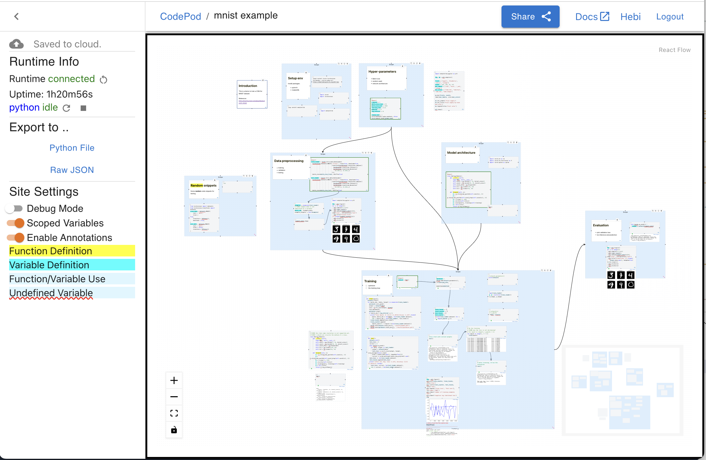

# Press & Screenshots

This document contains screenshots and gallery assets to give you an overall
feel of what coding in CodePod IDE looks like.

## Logo

<!--  -->

## Training a neural network for MNIST

## An example "Google Docs" project

## tree-based layout

## LDA example

## LDA example 2

